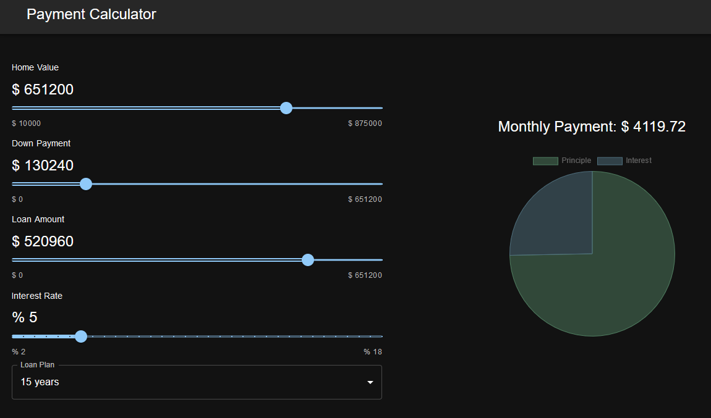

# Mortgage Calculator
This app helps you estimate principle and interests rates depending on your home value and loan plan selected. 

# Technologies Used
* React.Js
* Material UI
* React-Chartjs-2
* Chart.js

# Resources
[Material UI Documentation](https://mui.com/material-ui/react-typography/)

[React-Chartjs-2](https://react-chartjs-2.js.org/)

[Chart.js](https://www.chartjs.org/)

[Destructuring](https://developer.mozilla.org/en-US/docs/Web/JavaScript/Reference/Operators/Destructuring_assignment)

[React Components and Props](https://react.dev/reference/react/Component#setstate-parameters)

[React Components and Props (second source)](https://react.dev/learn/passing-props-to-a-component)

[React State Hooks](https://react.dev/reference/react#state-hooks)